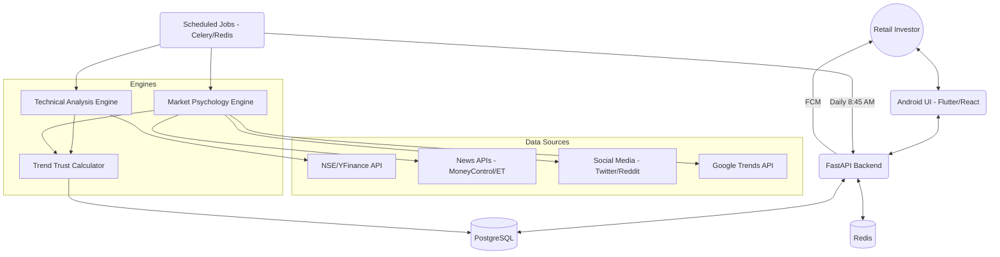

# System Architecture: Indian Stock Market Alert & Recommendation System

## 1. High-Level Architecture



## 2. Database Schema (PostgreSQL)

### Users & Portfolio
- **users**: `id, email, password_hash, fcm_token, created_at`
- **portfolios**: `id, user_id, symbol, quantity, avg_price, source (manual/api)`

### Stock Data
- **stocks**: `symbol, name, sector, is_active`
- **technical_snapshots**: `symbol, timestamp, price, rsi, macd, ma_20, ma_50, ma_200, volume, volume_avg_10d, trend_classification`
- **sentiment_snapshots**: `symbol, timestamp, news_score, social_score, search_momentum, retail_signal, psychology_phase`

### Recommendations & Alerts
- **daily_scans**: `id, date, top_5_json (symbol, trust_score, verdict)`
- **recommendations**: `id, symbol, user_id, action (BUY/SELL/HOLD), confidence, entry, stop_loss, target, reasoning`
- **alerts**: `id, user_id, symbol, trigger_type, message, status (sent/pending)`

---

## 3. Technical Analysis Engine (Pseudocode)

```python
class TechnicalAnalysisEngine:
    def calculate_indicators(self, symbol, timeframe='1d'):
        data = fetch_ohlcv(symbol, timeframe)
        
        # Calculate Moving Averages
        ma_20 = data['close'].rolling(window=20).mean()
        ma_50 = data['close'].rolling(window=50).mean()
        ma_200 = data['close'].rolling(window=200).mean()
        
        # RSI (14)
        rsi = compute_rsi(data['close'], 14)
        
        # MACD
        exp1 = data['close'].ewm(span=12, adjust=False).mean()
        exp2 = data['close'].ewm(span=26, adjust=False).mean()
        macd = exp1 - exp2
        signal = macd.ewm(span=9, adjust=False).mean()
        
        # Volume Analysis
        vol_avg_10d = data['volume'].rolling(window=10).mean()
        vol_spike = data['volume'].iloc[-1] / vol_avg_10d.iloc[-1]
        
        return {
            'ma_status': self.classify_trend(ma_20, ma_50, ma_200),
            'rsi': rsi.iloc[-1],
            'macd_crossover': macd.iloc[-1] > signal.iloc[-1],
            'volume_spike': vol_spike > 1.5
        }

    def classify_trend(self, ma20, ma50, ma200):
        curr = ma20.iloc[-1]
        if ma20.iloc[-1] > ma50.iloc[-1] > ma200.iloc[-1]:
            return "Strong Bullish"
        elif ma20.iloc[-1] > ma50.iloc[-1]:
            return "Weak Bullish"
        # ... logic for Bearish/Sideways
```

---

## 4. Market Psychology Engine

### Psychology Phases Scoring
- **Accumulation**: Low volume, neutral sentiment, price bottoming.
- **Early Hype**: Rising volume, positive news starts, social buzz +10%.
- **Euphoria**: Extreme RSI (>80), Social buzz >3x average, Retail participation high.
- **Distribution**: Price sideways despite news, volume spikes without price gain.
- **Panic**: Negative news cascade, volume-led deep red candles.

### Sentiment Model
`Score = (0.4 * NewsSentiment) + (0.3 * SocialBuzz) + (0.2 * SearchMomentum) + (0.1 * RetailVolumeSignal)`

---

## 5. Trend Trust Score Calculation

The **Trend Trust Score (0-100)** is the weighted average of Technical Strength and Crowdsource Sentiment.

```python
def calculate_trend_trust(symbol):
    tech_score = tech_engine.get_score(symbol) # 0-100 based on indicators
    psych_score = psych_engine.get_score(symbol) # 0-100 based on sentiment
    
    # Validation Layers
    if tech_score > 70 and psych_score > 70:
        trust_score = (tech_score * 0.6) + (psych_score * 0.4)
    elif tech_score < 40 and psych_score > 80:
        # Flag: RETAIL TRAP (Price weak, hype high)
        trust_score = (tech_score * 0.8) + (psych_score * 0.2)
        flag = "RETAIL_TRAP"
    else:
        trust_score = (tech_score * 0.5) + (psych_score * 0.5)
        
    return trust_score
```

---

## 6. Pre-Market Scanning Algorithm (Daily 8:45 AM)

1. **Universe Filter**: NSE 500 stocks.
2. **Momentum Filter**: Stocks with >2% gain in previous session or high after-market orders.
3. **Sentiment Filter**: Scrape news from last 12 hours (MoneyControl, Business Standard).
4. **Volume Filter**: Scan for volume breakouts in pre-market (when data starts) or previous day.
5. **Selection**: Rank by `Trend Trust Score`.
6. **Verdict Generation**:
   - If `Trust > 75`: Buy
   - If `50 < Trust < 75`: Hold
   - If `Trust < 50`: Avoid / Sell

---

## 7. API Definitions (FastAPI)

- `GET /portfolio`: List user holdings with real-time P/L.
- `POST /portfolio/add`: Manually add symbol/qty/price.
- `GET /trending`: Get Top 5 trending stocks with full reasoning.
- `GET /stock/{symbol}/analysis`: Deep dive into specific stock (Tech + Psych).
- `GET /alerts`: Fetch recent notifications.

---

## 8. 30-Day MVP Roadmap

| Week | Phase | Deliverables |
|------|-------|--------------|
| **Week 1** | **Foundations** | FastAPI setup, PostgreSQL schema, NSE Scraper (yfinance) |
| **Week 2** | **Logic Layer** | Tech Analysis Engine + Sentiment Analysis (NLP on News) |
| **Week 3** | **Verification**| Trust Score Algorithm + Pre-market Cron Job (8:45 AM) |
| **Week 4** | **UI & Deploy** | Android/Web Dashboard, Firebase CM Integration, Final UI Polish |

---

## Security & compliance
- **Advisory Only**: Disclaimer shown on every recommendation.
- **Read-Only**: No trading secret keys stored.
- **Encryption**: AES-256 for user credentials.
